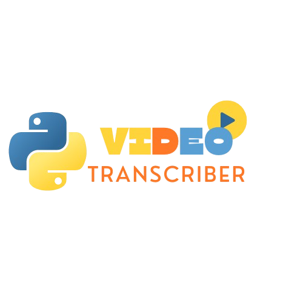

# Video Transcriber

## Overview

The Video Transcriber is a Python application that transcribes audio from video files into subtitles. It uses the Whisper model from OpenAI for transcription and generates an SRT file with subtitles. The application provides a graphical user interface using `tkinter`.

## Features

- Extracts audio from video files.
- Transcribes audio to text using Whisper.
- Generates SRT subtitles file.


*Example of the main interface.*
## Requirements

Ensure you have Python installed. The following Python libraries are required:

- `moviepy` for audio extraction.
- `torch` for machine learning operations.
- `whisper` for transcription.

You can install the required libraries using the provided `requirements.txt` file.

## Installation

1. Clone the repository or download the source code.

2. Navigate to the project directory.

3. Install the required libraries:
```bash
pip install -r requirements.txt
```

## Usage
1. Run the application:
``` bash
python GUI.py
```
2. In the application:
- Click the "Browse" button to select a video file.
- Click the "Process" button to start transcription.

3. The text area will display a message indicating that subtitles are being processed and will update once the processing is complete. The SRT file will be named as the video file name with an .srt extension and saved in the same directory as the video file.

## File Naming Convention
The generated subtitles file will be named according to the video file name with the .srt extension. For example, if the video file is named `example.mp4`, the subtitle file will be `example.srt`.

## Future Scopes

Here are some potential enhancements and features that could be added to the Video Transcriber in future updates:

1. **Support for Additional File Formats:**
   - Extend support to additional video and audio formats beyond the current ones. This may include formats like `.mov`, `.flv`, or `.wav`.

2. **Language Detection and Support:**
   - Integrate automatic language detection and support for multiple languages. Enhance the Whisper model integration to handle various languages more efficiently.


3. **Improved User Interface:**
   - Enhance the graphical user interface (GUI) with features such as:
     - Drag-and-drop file selection.
     - Progress indicators for audio extraction and transcription.
     - Customizable settings for subtitle appearance (e.g., font size, color).


4. **Export Options:**
   - Provide additional subtitle export options, such as formats like `.vtt` or `.ass`. Add features to customize subtitle formatting and timing.

Feel free to contribute to the project or suggest additional features and improvements. Your feedback is valuable for making the Video Transcriber tool better!